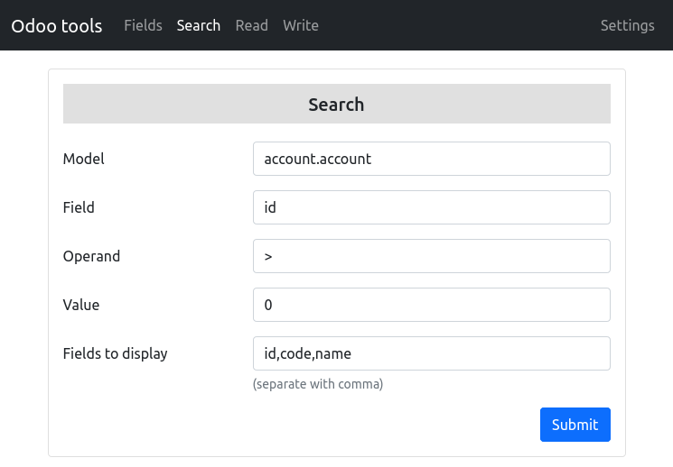

# Odoo PHP Tools

This is a simple set of tools to search, read and write entries in the Odoo database.

No data are saved on the server. All entered fields are saved in cookies locally in your browser.

## Odoo version
The tools have been tested with version 15 of Odoo.

## Live test
http://odoo.coolpage.biz

## Security
Generate an API key you can dispose after testing. [More information.](https://www.odoo.com/documentation/15.0/developer/misc/api/odoo.html#api-keys)

## Example

## License
MIT License. Copyright (c) 2022 Kjeld Borch Egevang

